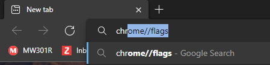
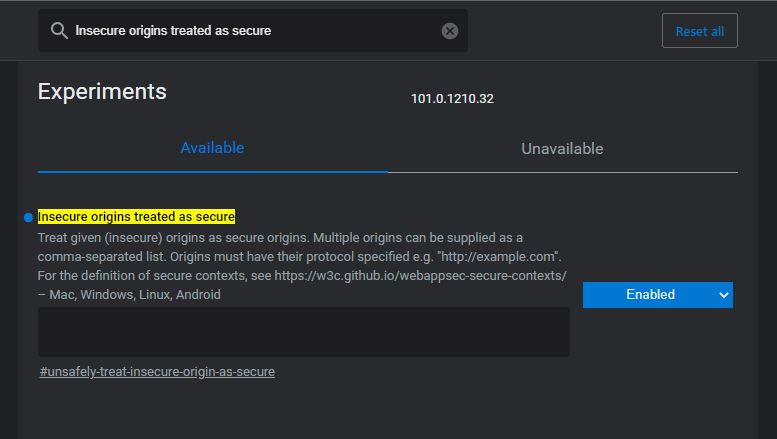
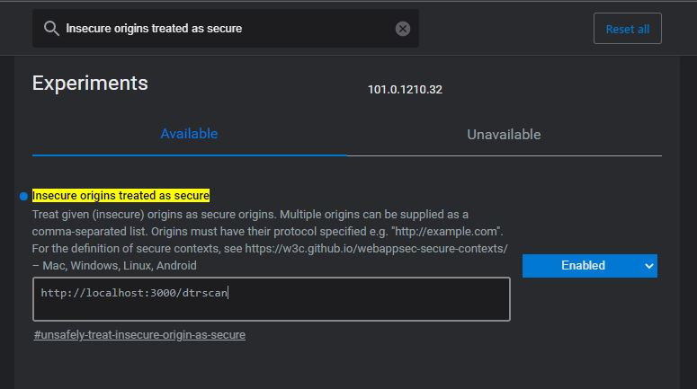
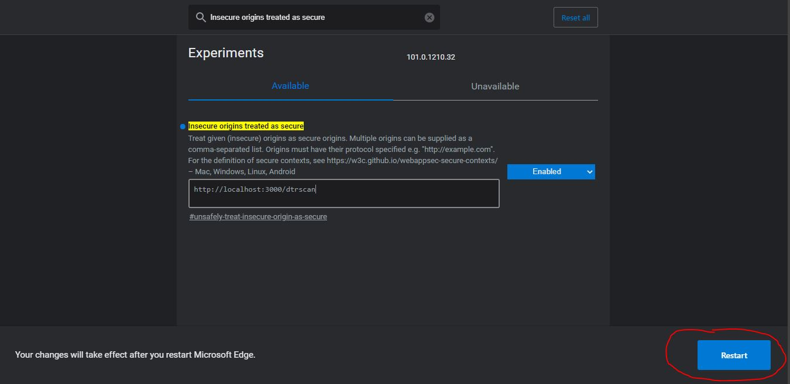

# Daily Time Record for HRMIS
A codeigniter project that aims to create a DTR module. Includes scaning of QR Code and displaying it in a time calender format indicating the time of his/her arival.

## Access Camera over HTTP Protocol
Direct access to the camera is a powerful feature. It requires consent from the user, and your site MUST be on a secure origin (HTTPS). Either convert the website to HTTPS or **Follow the steps below to enable direct access to the camera using HTTP Protocol.**

### Step 1: Type *chrome://flags* in the Google address bar and hit enter.

### Step 2: Search *Insecure origins treated as secure* then select enable.

### Step 3: Copy the link of the website that uses camera then paste in the textbox

### Step 4: Restart the Google Browser 

